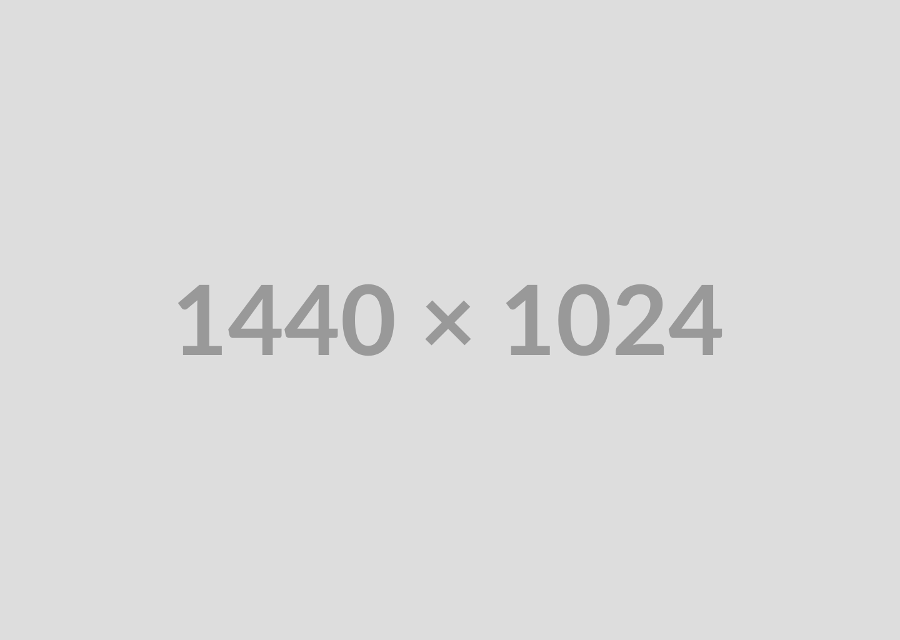

<!-- Header -->

  

<!-- project overview -->

Slotify is a B2B SaaS platform designed to simplify and automate appointment and resource management for businesses.
It leverages AI to:

Automate client bookings and interactions through a WhatsApp AI assistant powered by a local LLM.

Dynamically assign staff and resources to appointments, with smart handling of cancellations and conflicts, and instantly notify clients via WhatsApp with updates.

Provide an AI-powered real-time call assistant for bookings, Q&A, and instant client support.

With Slotify, businesses can reduce scheduling overhead, improve client communication, and ensure smooth operations even when staff availability changes unexpectedly.

  

<!-- System Design -->

### Component Diagram

This diagram illustrates the main components of Slotify and their interactions.

  

### ER Diagram

This diagram shows the entity relationships within Slotify's data model.

  

<!--- Project Highlights --->

### Add Title Here

- List the sexy features.

  

<!-- Demo -->

### User Screens (Mobile)

| Login screen                            | Register screen                       | Register screen                       |
| --------------------------------------- | ------------------------------------- | ------------------------------------- |
|  |  |  |

### Admin Screens (Web)

| Login screen                            | Register screen                       |
| --------------------------------------- | ------------------------------------- |
|  |  |

  

<!-- Development & Testing -->

### Add Title Here

| Services                            | Validation                       | Testing                        |
| --------------------------------------- | ------------------------------------- | ------------------------------------- |
|  |  |  |

  

<!-- Deployment -->

### Add Title Here

- Description here.

| Postman API 1                            | Postman API 2                       | Postman API 3                        |
| --------------------------------------- | ------------------------------------- | ------------------------------------- |
|  |  |  |

  

