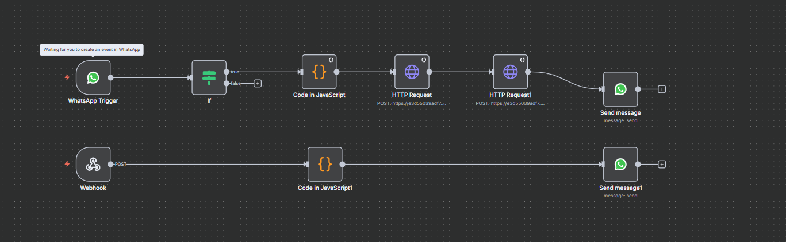
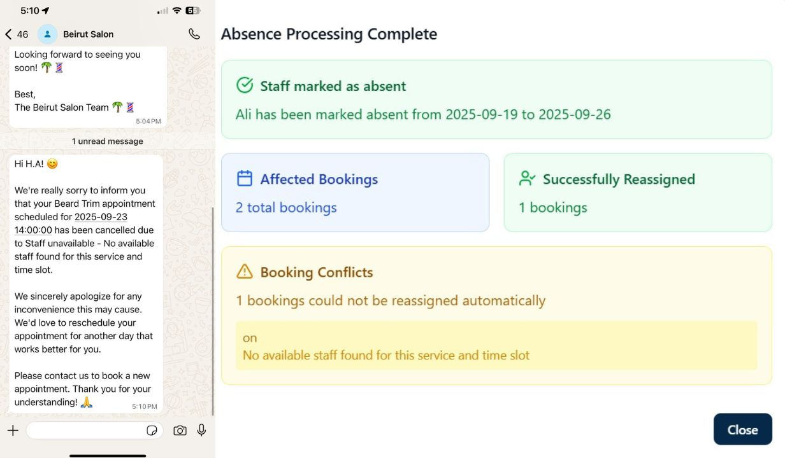
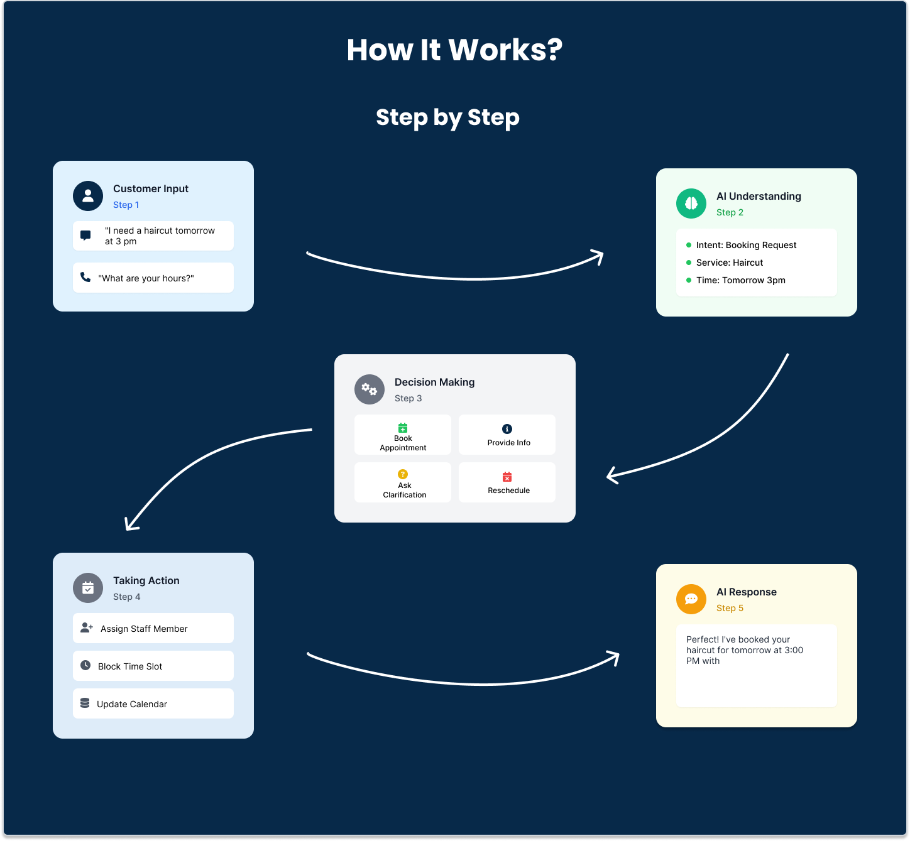
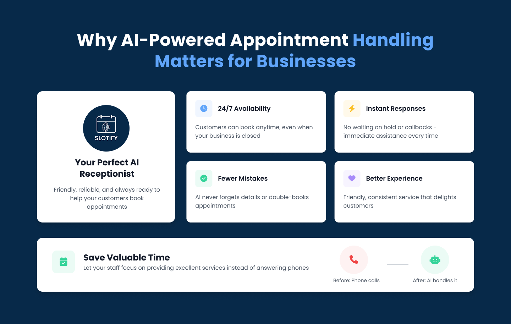

<!-- Header -->


<br><br>

<!-- project overview -->


> Slotify is a B2B SaaS platform designed to simplify and automate appointment and resource management for businesses. It leverages AI to:

> Automate client bookings and interactions through a WhatsApp AI assistant powered by a local LLM.

> Dynamically assign staff and resources to appointments, with smart handling of cancellations and conflicts, and instantly notify clients via WhatsApp with updates.

> Provide an AI-powered real-time call assistant for bookings, Q&A, and instant client support.

> With Slotify, businesses can reduce scheduling overhead, improve client communication, and ensure smooth operations even when staff availability changes unexpectedly.

<br><br>
<!-- Project Highlights -->


### Why Slotify Stands Out


| Features Overview |
| --------------------------------------- |
|  |

<br><br>


<!-- System Design -->


**All system design diagrams are available here:**
[Eraser Workspace - Slotify Diagrams](https://app.eraser.io/workspace/kpMq0AEkfNANwjx9BMP4?origin=share)

### Component Diagram

 

### ER Diagram

 

### WhatsApp Booking Flow Diagram 

  

### AI Call Flow Diagram

  

### Dynamic Staff Assignment Flow

  

### N8N Workflow Integration

  

<br><br>

<!-- Demo -->


### Admin Screens (Web)

| Business Hub                            | Dashboard Overview                    |
| --------------------------------------- | ------------------------------------- |
|  |  |

| Clients Management                    | Resources Management                 |
| ------------------------------------- | ------------------------------------- |
|  |  |

### Client Screens

| Real-time Voice Call |
| -------------------- |
|  |

| Booking via WhatsApp (Video) | Services via WhatsApp (Video) |
| ---------------------------- | ----------------------------- |
|  |  |

<br><br>

#### Automatic Staff Assignment & Client Notification Example




<!-- Development & Testing -->


### Testing & Test Results

To run tests for the Next.js client:

```bash
cd client
npm test
```

To run tests for the Laravel backend:

```bash
cd server
php artisan test
```

| Next.js Test Results                    | Laravel Test Results                  |
| --------------------------------------- | ------------------------------------- |
|  |  |

<br>

| Controller Example | Service Example |
| ------------------ | -------------- |
|  |  |


## AI Agent Process for Non-Technical Readers

**What is the AI Agent?**

The AI Agent is like a smart digital assistant that understands what customers want when they send messages or make voice calls to book appointments. It acts like a knowledgeable employee who can instantly help customers 24/7.

 

### Why This Matters for Businesses
  

<!-- Deployment -->


### API Testing with Postman

| Postman API 1                            | Postman API 2                       | Postman API 3                        |
| --------------------------------------- | ------------------------------------- | ------------------------------------- |
|   |  |  |

### API Documentation with Swagger

Swagger provides interactive API documentation for Slotify's backend endpoints. To access Swagger when running the application:

1. Start the Laravel backend server: `php artisan serve`
2. Navigate to `http://localhost:8000/api/documentation` in your browser
3. Explore and test API endpoints directly through the interactive interface

| Swagger Screenshot 1                    | Swagger Screenshot 2                  | Swagger Screenshot 3                  |
| --------------------------------------- | ------------------------------------- | ------------------------------------- |
|  |  |  |

### Linear Project Management

Linear was used for efficient project management and task tracking throughout the development of Slotify. The screenshots below showcase the organized workflow, issue tracking, and PRs.

| Linear Board 1                          | Linear Board 2                        | Linear Board 3                        |
| --------------------------------------- | ------------------------------------- | ------------------------------------- |
|  |  |  |

<br><br>
