<!-- Header -->


<br><br>

<!-- project overview -->


> Slotify is a B2B SaaS platform designed to simplify and automate appointment and resource management for businesses. It leverages AI to:

> Automate client bookings and interactions through a WhatsApp AI assistant powered by a local LLM.

> Dynamically assign staff and resources to appointments, with smart handling of cancellations and conflicts, and instantly notify clients via WhatsApp with updates.

> Provide an AI-powered real-time call assistant for bookings, Q&A, and instant client support.

> With Slotify, businesses can reduce scheduling overhead, improve client communication, and ensure smooth operations even when staff availability changes unexpectedly.

<br><br>
<!-- Project Highlights -->


### Why Slotify Stands Out


| Features Overview |
| --------------------------------------- |
| 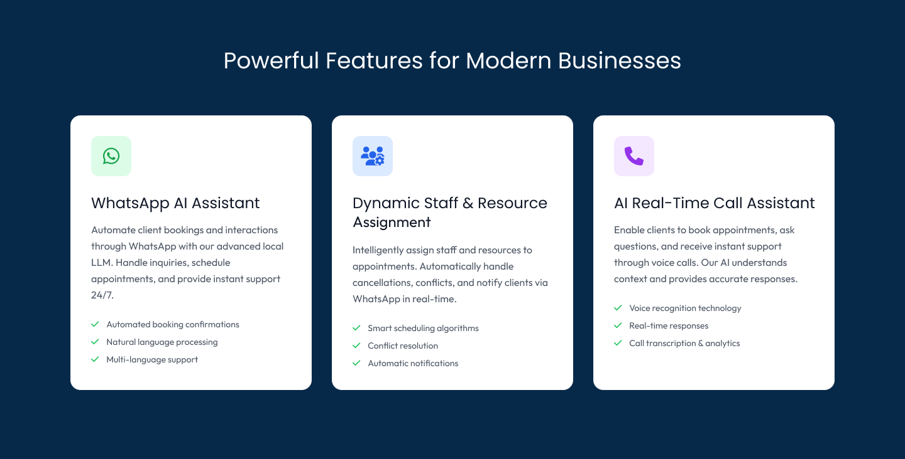 |

<br><br>


<!-- System Design -->


**All system design diagrams are available here:**
[Eraser Workspace - Slotify Diagrams](https://app.eraser.io/workspace/kpMq0AEkfNANwjx9BMP4?origin=share)

### Component Diagram

 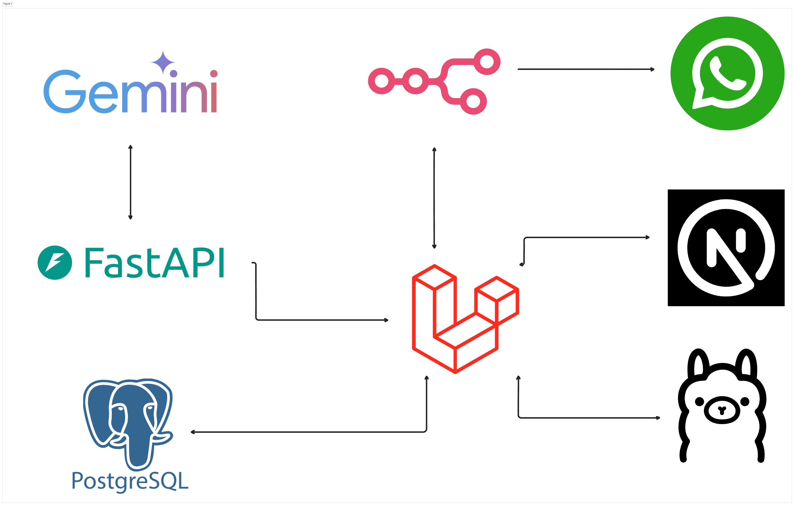 

### ER Diagram

 

### WhatsApp Booking Flow Diagram 

 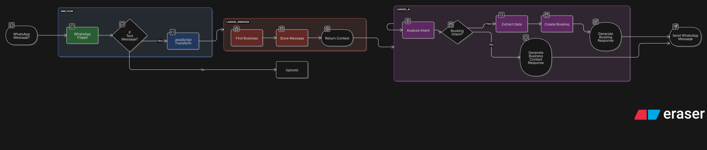 

### AI Call Flow Diagram

 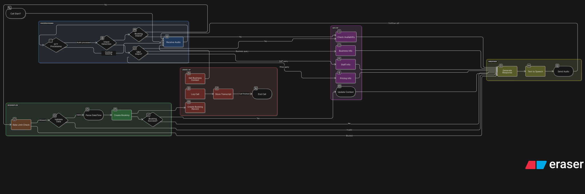 

### Dynamic Staff Assignment Flow

 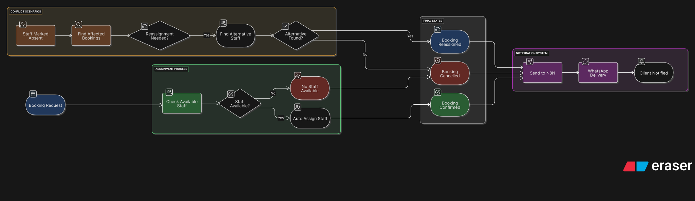 

<br><br>

<!-- Demo -->


### Admin Screens (Web)

| Business Hub                            | Dashboard Overview                    |
| --------------------------------------- | ------------------------------------- |
| 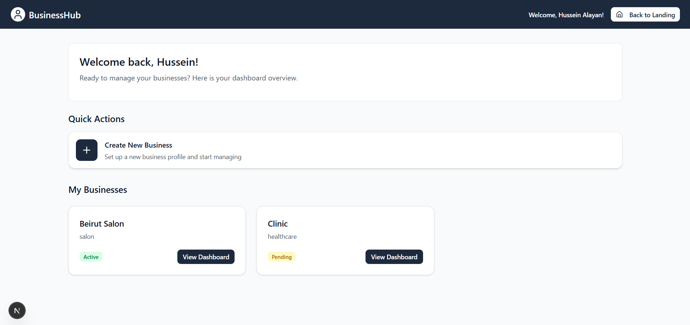 | 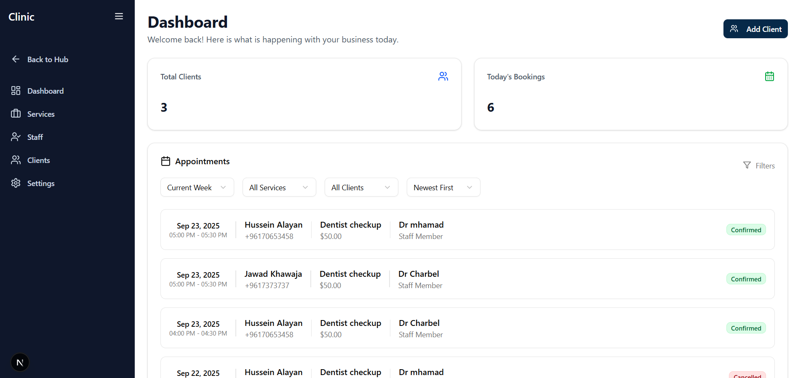 |

| Clients Management                    | Resources Management                 |
| ------------------------------------- | ------------------------------------- |
| 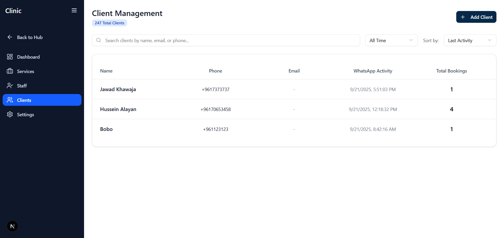 | 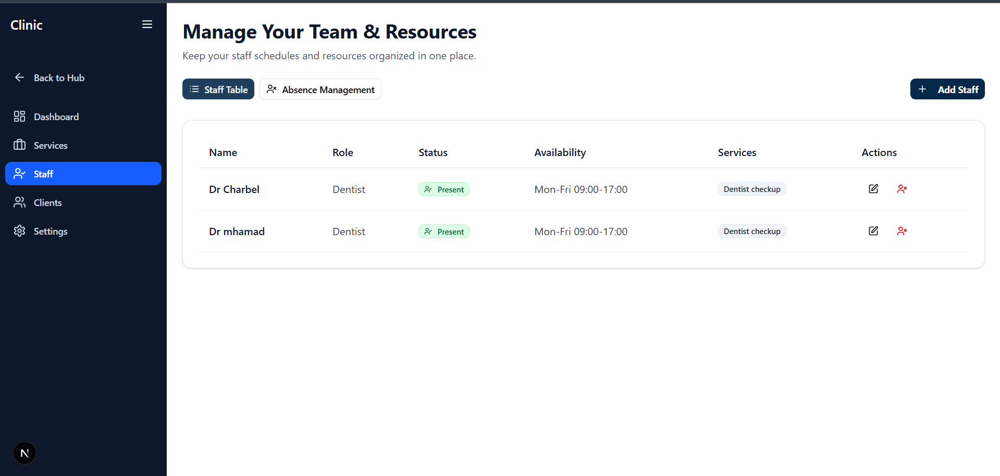 |

### Client Screens

| Real-time Voice Call |
| -------------------- |
| 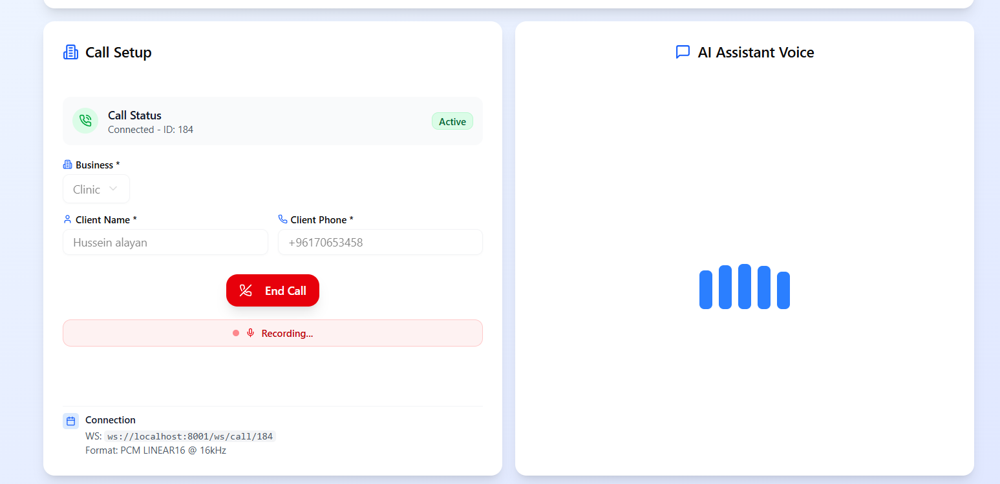 |

| Booking via WhatsApp (Video) | Services via WhatsApp (Video) |
| ---------------------------- | ----------------------------- |
|  |  |

<br><br>


<!-- Development & Testing -->


### Testing & Test Results

To run tests for the Next.js client:

```bash
cd client
npm test
```

To run tests for the Laravel backend:

```bash
cd server
php artisan test
```

| Next.js Test Results                    | Laravel Test Results                  |
| --------------------------------------- | ------------------------------------- |
| 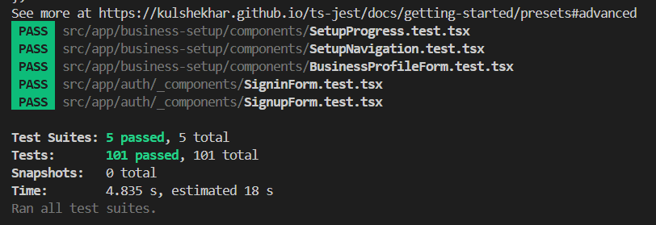 | 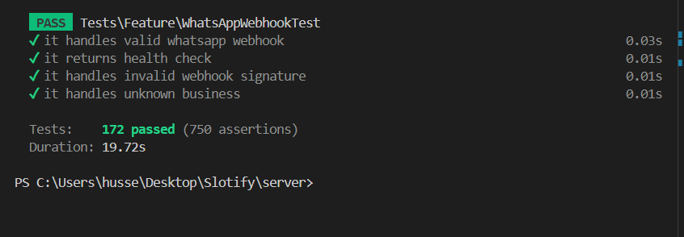 |

<br>

| Controller Example | Service Example |
| ------------------ | -------------- |
| 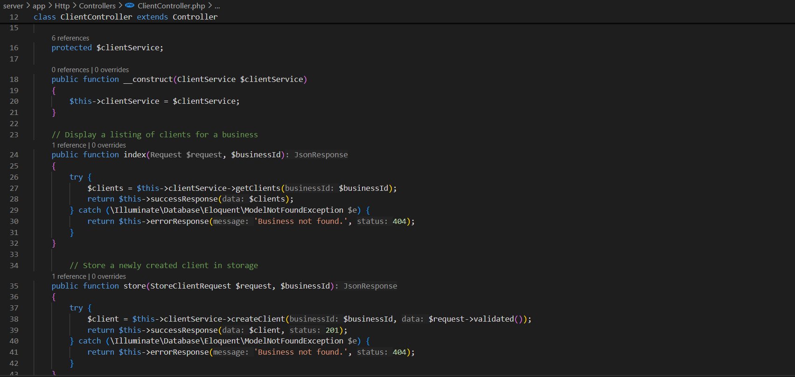 | 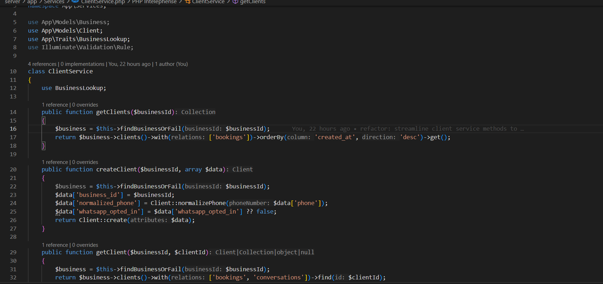 |


## AI Agent Process for Non-Technical Readers

**What is the AI Agent?**

The AI Agent is like a smart digital assistant that understands what customers want when they send messages or make voice calls to book appointments. It acts like a knowledgeable employee who can instantly help customers 24/7.

### How It Works: Step by Step

**1. Customer Input (What Goes In)**
	- Text Messages: "I want a haircut tomorrow at 3pm"
	- Voice Calls: Customer speaks their request over the phone
	- Questions: "What services do you offer?" or "What are your hours?"

**2. Understanding Phase (What the AI Thinks About)**
	- What does this customer want?
		- Are they trying to book an appointment?
		- Are they asking a question about services?
		- Do they want to cancel or reschedule?
	- What specific details did they mention?
		- Which service? (haircut, facial, massage)
		- What date? (tomorrow, Monday, next week)
		- What time? (3pm, morning, afternoon)

**3. Decision Making (What the AI Decides)**
	- If it's a booking request:
		- Check if the requested service exists
		- See if the time slot is available
		- Find the right staff member
		- Create the appointment
	- If it's a question:
		- Look up business information (hours, services, prices)
		- Provide helpful answers using the business details
	- If something is unclear:
		- Ask follow-up questions to get missing information

**4. Taking Action (What the AI Does)**
	- For Bookings:
		- Creates the appointment in the system
		- Assigns the right staff member
		- Blocks the time slot so no one else can book it
	- For Questions:
		- Gathers the relevant business information
		- Prepares a helpful response

**5. Response Generation (What the AI Says Back)**
	- The AI creates personalized responses that match the business's style:
		- **Booking Confirmation:**
			> "Great! I've booked your haircut with Sarah for tomorrow at 3:00 PM. We're excited to see you! 💇‍♂️"
		- **Information Response:**
			> "We offer haircuts ($25), beard trims ($15), and styling ($35). Our hours are 9 AM - 6 PM, Monday through Saturday. What would you like to book?"
		- **Problem Response:**
			> "I'm sorry, 3 PM tomorrow is already taken. How about 2:30 PM or 4:00 PM instead?"

---

### Real Example: Customer Journey

**Customer sends:**
> "Book me for a facial next Tuesday at 11am"

**AI Understands:** This is a booking request for facial service, Tuesday, 11:00 AM
**AI Checks:** Is facial service available? Is Tuesday 11 AM free? Who can do facials?
**AI Finds:** Facial service exists, time is available, Sarah can do it
**AI Books:** Creates appointment: Tuesday 11 AM, Facial with Sarah
**AI Responds:**
> "Perfect! Your facial is booked with Sarah for Tuesday at 11:00 AM. Can't wait to help you relax and rejuvenate! ✨"

---

### Why This Matters for Businesses

- **24/7 Availability:** Customers can book anytime, even when the business is closed
- **Instant Responses:** No waiting on hold or for callbacks
- **Fewer Mistakes:** AI doesn't forget details or double-book appointments
- **Better Customer Experience:** Friendly, consistent service every time
- **Time Savings:** Staff can focus on providing services instead of answering phones

The AI Agent essentially acts like having a perfect receptionist who never sleeps, never gets confused, and always knows exactly what services are available and when.

<!-- Deployment -->


### API Testing with Postman

| Postman API 1                            | Postman API 2                       | Postman API 3                        |
| --------------------------------------- | ------------------------------------- | ------------------------------------- |
| 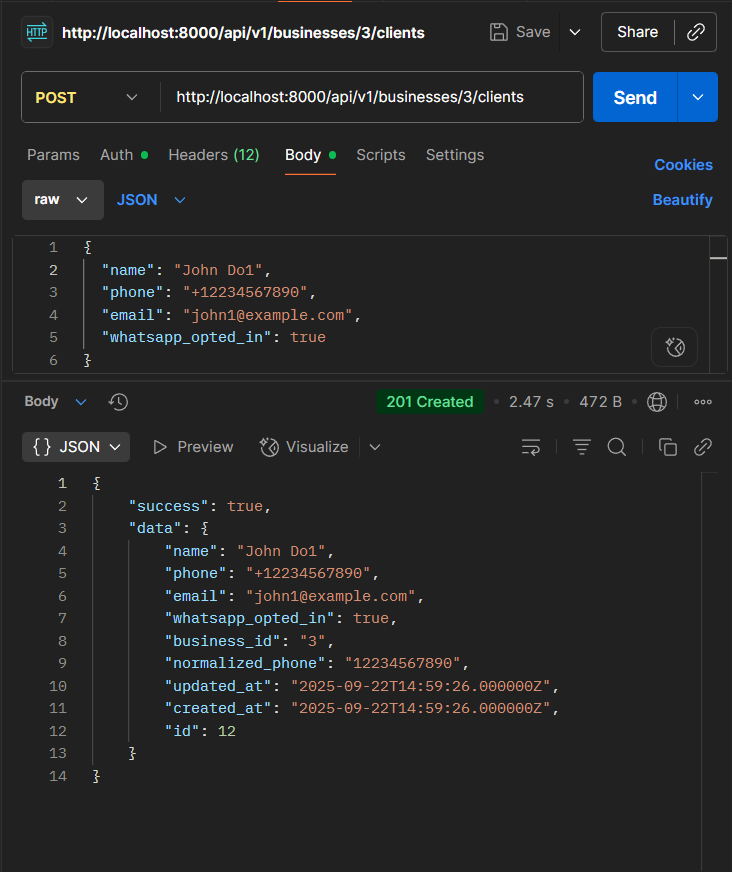  | 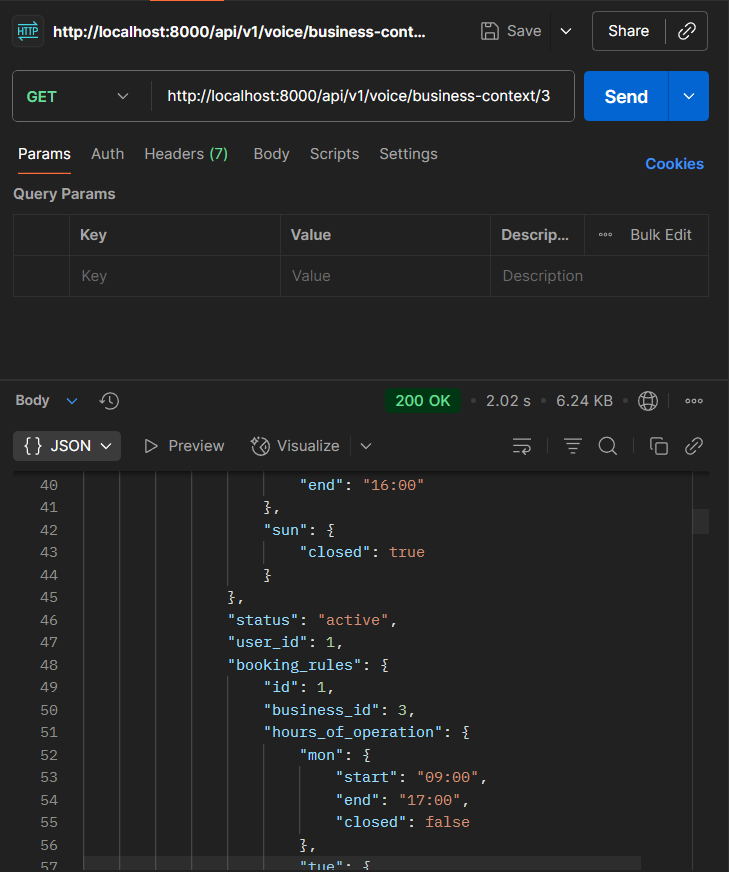 | 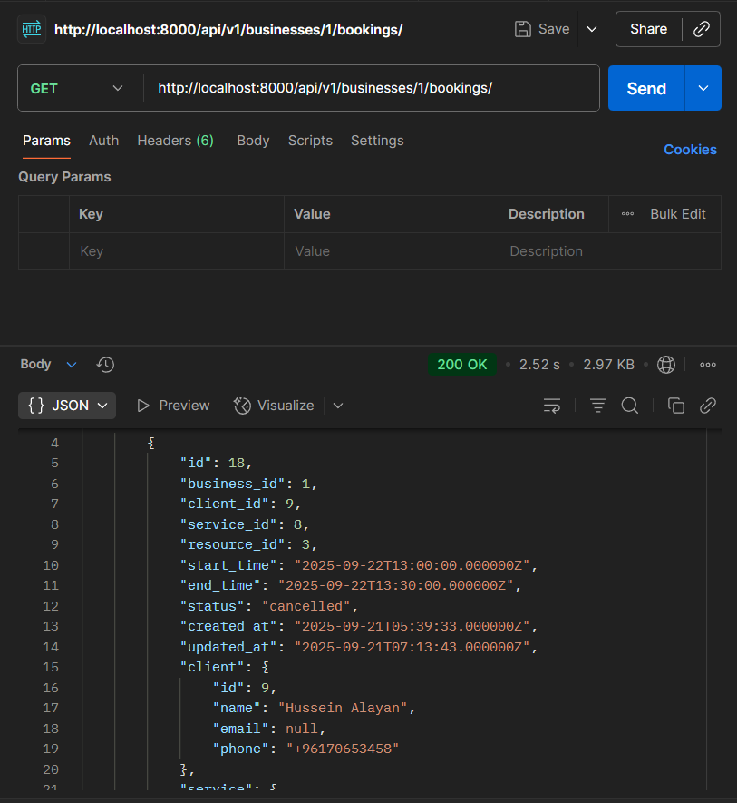 |

### API Documentation with Swagger

Swagger provides interactive API documentation for Slotify's backend endpoints. To access Swagger when running the application:

1. Start the Laravel backend server: `php artisan serve`
2. Navigate to `http://localhost:8000/api/documentation` in your browser
3. Explore and test API endpoints directly through the interactive interface

| Swagger Screenshot 1                    | Swagger Screenshot 2                  | Swagger Screenshot 3                  |
| --------------------------------------- | ------------------------------------- | ------------------------------------- |
|  |  |  |

### Linear Project Management

Linear was used for efficient project management and task tracking throughout the development of Slotify. The screenshots below showcase the organized workflow, issue tracking, and PRs.

| Linear Board 1                          | Linear Board 2                        | Linear Board 3                        |
| --------------------------------------- | ------------------------------------- | ------------------------------------- |
| 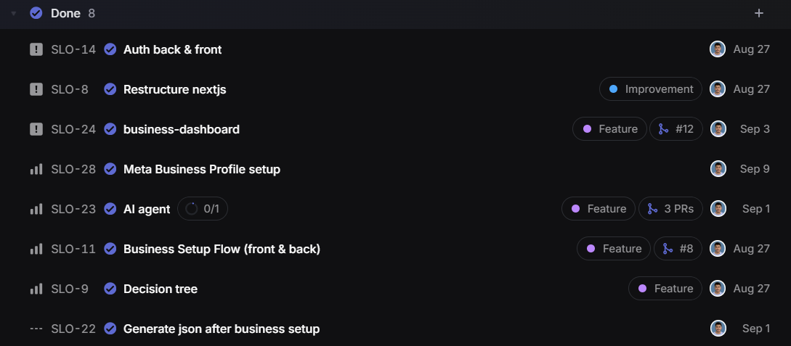 | 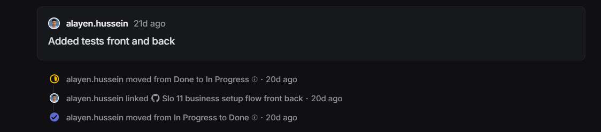 | 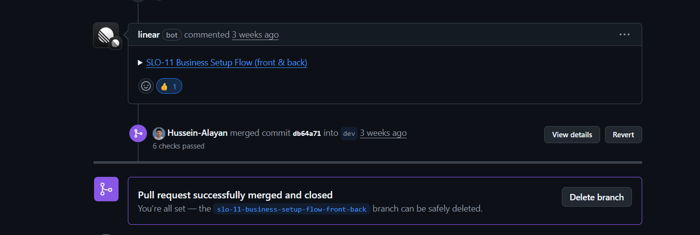 |

<br><br>
